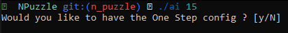
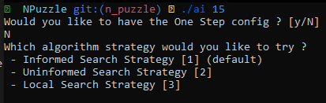
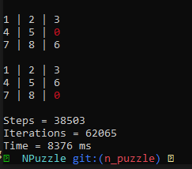

# DP_probsolving - NPuzzle

Goal of the NPuzzle class was to enable a user to resolve any NPuzzle problem using an uninformed, informed and local search strategies.

Informed Algorithm - Best First Search  
Uninformed Algorithm - Depth First Search  
Local Algorithm - Hill Climbing Unfortunately the local search strategy isn't fully functionnal (will cause an infinite loop on random generated initial configuration).  

## Results
To see the result I precompiled a binary in this branch. It was compiled and tested using WSL 2 so it might not work another way.  

### Input Usage
#### Base

#### One Step Selection
The One Step where designed to use a thread to lock the mutex and see each node but was rework to continue the algorithm when user press enter

#### Algorithm Selection

#### Result


To change and try to recompile a specific config:
Recompile using the existing Makefile :
```
make re
```
