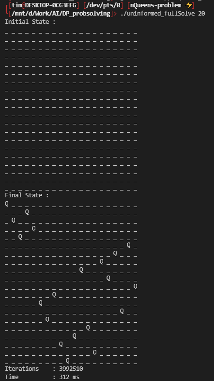
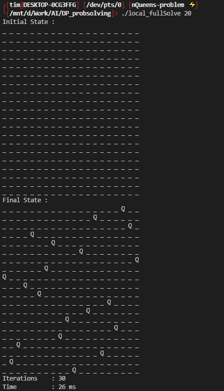
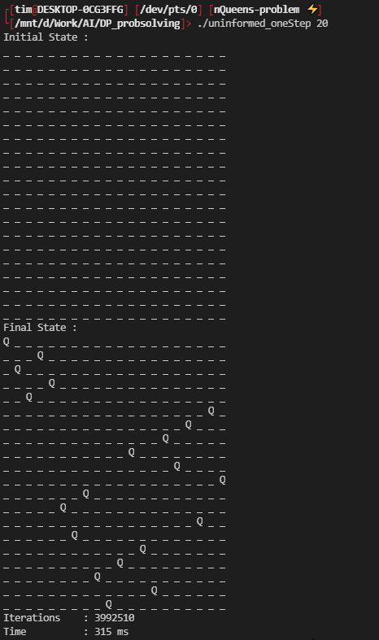
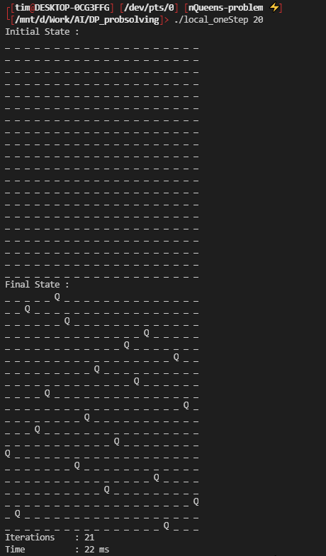

# DP_probsolving - NQueens

Goal of the NQueens class was to enable a user to resolve any NQueens problem using an uninformed, informed and local search strategies.

Unfortunately I didn't implement the informed strat (wished to implement the A* and the Best First Search).  
Uninfomed Algorithm - Depth First Search  
Local Algorithm - Hill Climbing  

## Results
To see the result I precompiled 4 binaries in this branch. Those were compiled and tested using WSL 2 so it might not work another way.  

### Full Solve Results
#### Uninformed

#### Local


### One Step
The One Step where designed to use a thread to lock the mutex and see each node.  
#### Uninformed

#### Local


To change and try to recompile a specific config, changes are done in the *nqueens_main.cpp* :
``` cpp
// nqueens_main.cpp : 57
Board b(size, State(size, 0));
int sm = 0; // solveMethod : 0 = full solve | 1 = reset | 2 = one step
int strat = 1; // strategy : 0 = informed | 1 = uninformed | 2 = local

// .....
```

then recompile using g++ :
```
g++ nqueens_main.cpp NQueens.cpp -o [STRATEGY]_[SOLVEMETHOD]
```
